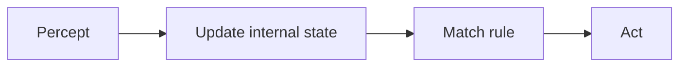
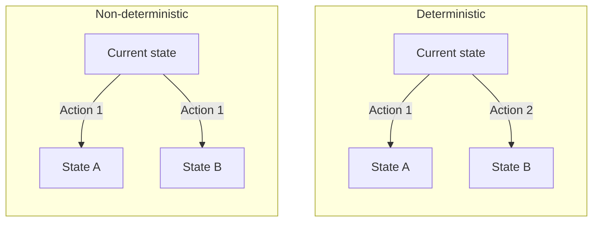

# AI Lec01 — Intro Agents (2026)

> 📄 [View original PDF](documents/ai-lec01-intro-agents-20260630.pdf) — source of truth

Artificial Intelligence
Instructor: Kietikul Jearanaitanakij
Department of Computer Engineering
King Mongkut's Institute of Technology Ladkrabang

---

- Textbook: Artificial Intelligence A Modern Approach

By Stuart Russell and Peter Norvig

---

## Lecture 1

- What is AI?
- Intelligent agents
- Agent program
- Properties of environments

---

## What is Artificial Intelligence (AI)?

- AI encompasses various subfields, ranging from the general to the specific, such as playing chess, writing poetry, driving a car, and diagnosing diseases.
- The definition of AI can be organized into four categories.

| Thinking Humanly | Thinking Rationally |
|---|---|
| Acting Humanly * | Acting Rationally |

*Need the Turing test

---

## Acting Humanly: The Turing Test Approach

- The Turing Test, proposed by Alan Turing (1950), was designed to provide a satisfactory operational definition of intelligence.
- A computer passes the test if a human interrogator cannot tell whether the written responses come from a person or a computer.

---

### To take the Turing Test, the computer needs the following capabilities:

- **Natural language processing**
- **Knowledge representation** (transform fact to sentence)

  Ex. Today is hot → IS(Today, Hot)

- **Automated reasoning**

  Ex. Bigger(A, B) and Bigger(B, C) → Bigger(A, C)

- **Machine learning**

---

## Intelligent Agents

An agent is anything that can be viewed as **perceiving** its environment through **sensors** and **acting** upon that environment through **effectors** (actuators).

> 📄 See [PDF page 7](documents/ai-lec01-intro-agents-20260630.pdf#page=7) — diagram: Agent interacting with environment via sensors and effectors.

---

### Rationality

We want our agent to be **rational** — one that always does the right thing (most successful). Rationality depends on four things:

1. **Performance measure** — defines what "success" means
2. **Percept sequence** — everything the agent has perceived so far
3. **Environment knowledge** — what the agent knows about the world
4. **Available actions** — what the agent can do

> 📄 See [PDF page 8](documents/ai-lec01-intro-agents-20260630.pdf#page=8) — overview diagram of agent types.

---

## Agent Program

### 0) Table Lookup (won't be counted as agent program)

Keeping in memory its entire percept sequence, and using it to index into a table, which contains the appropriate action for all possible percept sequences.

| Percept Sequence | Action |
|---|---|
| P3, P1, P4, P2, P1, P4, P2, ..., Pi | A2 |
| P1, P4, P6, P2, P3, P5, P3, ..., Pj | A4 |
| P3, P1, P7, P10, P3, P4, P2, ..., Pk | A1 |
| P2, P6, P4, P2, P1, P4, P9, ..., Pn | A3 |
| ... | ... |

**Example: Checker**

> 📄 See [PDF page 10](documents/ai-lec01-intro-agents-20260630.pdf#page=10) — checkerboard state representation for table lookup.

### Disadvantages

1. **Space** (Ex: Chess needs 35^100 entries ≈ 2.55E+154)
2. **Time** (Construction & Execution)
3. **No autonomy** (If the percept sequence doesn't perfectly match, it takes no action)
4. **Take forever** for agent to learn the table entries

---

## Agent Program

### 1. Simple Reflex Agents

These agents select actions based solely on the **current percept**, ignoring the rest of the percept history.

```
IF car-in-front-is-braking THEN initiate-braking
```

A simple reflex agent acts according to a rule whose condition matches the current percept. The state is defined purely by the current percept.

> 📄 See [PDF page 12](documents/ai-lec01-intro-agents-20260630.pdf#page=12) — simple reflex agent diagram.

---

## Agent Program

### 2. Model-based Reflex Agents

Some problems need to handle **partial observability** — the agent must maintain an internal state that tracks aspects of the world it cannot currently see.

For the braking problem: the agent needs the previous frame from the camera to detect when two red brake lights go on/off simultaneously — a single frame isn't enough.



> 📄 See [PDF page 13](documents/ai-lec01-intro-agents-20260630.pdf#page=13) — model-based reflex agent diagram.

### 2. Model-based Reflex Agents (Cont.)

> 📄 See [PDF page 14](documents/ai-lec01-intro-agents-20260630.pdf#page=14) — how the model updates: Model → Current state → Next state → Action.

---

## Agent Program

### 3. Goal-based Agents

When the agent can do more than one action at the current state, it needs some sort of **goal information** that describes situations that are desirable. The agent considers future consequences — "which action brings me closer to my goal?"

> 📄 See [PDF page 15](documents/ai-lec01-intro-agents-20260630.pdf#page=15) — goal-based agent diagram.

---

### 4. Utility-based Agents

A more general performance measure should allow a comparison of different world states according to exactly **how happy** they would make the agent. Unlike goals (which are binary: achieved or not), utility gives a continuous measure of preference.

> 📄 See [PDF page 16](documents/ai-lec01-intro-agents-20260630.pdf#page=16) — utility-based agent diagram.

---

## Properties of Environments

### Fully observable vs. partially observable

If an agent's sensors give it access to the complete state of the environment (that are relevant to the choice of action) at each point in time, then we say that the environment is **fully observable**.

An environment might be **partially observable** because of noisy and inaccurate sensors or because parts of the state are simply missing from the sensor data.

### Single agent vs. multiagent

---

## Properties of Environments

### Deterministic vs. stochastic

If the next state of the environment is completely determined by the current state and the action executed by the agent, then we say the environment is **deterministic**; otherwise, it is **stochastic**.



The radio station: the listener is not aware of the next song.

---

## Properties of Environments

### Episodic vs. sequential

| Episodic | Sequential |
|----------|------------|
| Agent's experience divided into atomic episodes | Current decision affects all future decisions |
| Each episode: receive percept → perform action → done | Actions build on previous outcomes |
| Next episode does NOT depend on previous actions | Next state depends on prior actions |
| Example: Robot in assembly line | Example: Taxi driver |

---

## Properties of Environments

### Static vs. dynamic

If the environment can change while an agent is deliberating, then we say the environment is **dynamic** for that agent; otherwise, it is **static**.

- Static: Backgammon
- Dynamic: Part picking robot

---

## Properties of Environments

### Discrete vs. continuous

| Discrete | Continuous |
|----------|------------|
| Limited number of distinct states, percepts, and actions | Infinite range of values |
| Example: Chess, Checkers | Example: Medical diagnosis |

---

## Properties of Environments

### Known vs. unknown

In a known environment, the outcomes for all actions are given. Obviously, if the environment is unknown, the agent will have to learn how it works in order to make good decisions.

- Known: Checker
- Unknown: Robot on unknown planet
