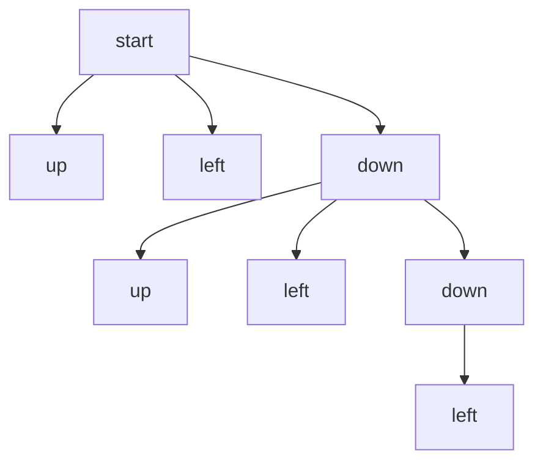
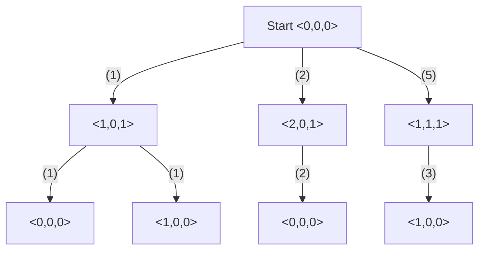
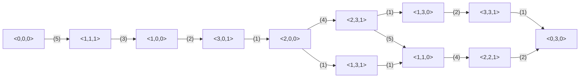
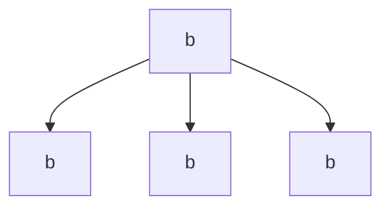
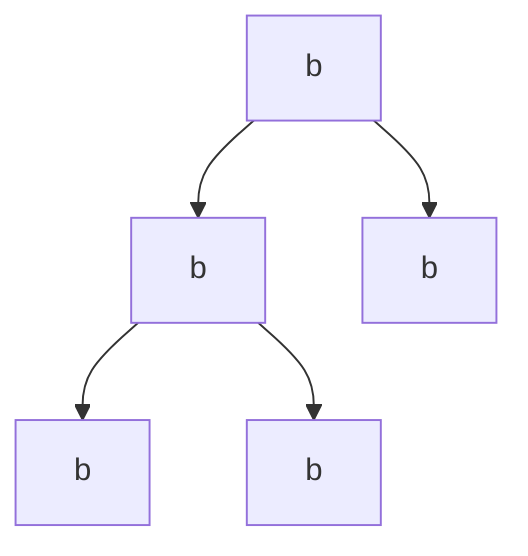
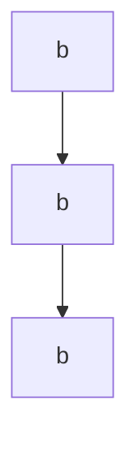

# AI Lec02 — Problem Solving Agents (2026)

> 📄 [View original PDF](documents/ai-lec02-problem-solving-agents-20260630.pdf) — source of truth

Artificial Intelligence
Instructor: Kietikul Jearanaitanakij
Department of Computer Engineering
King Mongkut's Institute of Technology Ladkrabang

---

## Lecture 2

Solving problems by searching

- Problem-solving agents
- Case studies
- Measuring problem-solving performance

---

## Problem-solving Agents

- **Recall: Simple reflex agents**
  - Actions based on only percepts
  - No knowledge
  - No goal
- **Problem-solving agents**
  - Goal-based agent
  - Finding sequences of actions that lead from the start state to the goal state.
  - **Goal Formulation:** define a goal state based on the current state. This is the first step in problem-solving.
  - **Problem Formulation:** define actions and states to be considered for reaching the goal.

```
Simple reflex agent → Goal-based agent
```

---

## Case Study 1: Vacuum World

- This particular world has just two locations: squares A and B.
- The vacuum agent perceives which its location and whether there is dirt in the square.
- **Action:** { move left, move right, suck up the dirt, do nothing }
- **Goal:** { Goal1, Goal2 }

```
Goal1    Goal2
```

---

## Case Study 1: Vacuum World

- **Formulating problem**
  - **Possible actions:** { Left, Right, Suck, None }
  - **States:** 8 possible states
  - **Path cost:** The number of steps in the path (each step costs 1).

```
Goal1    Goal2
```

---

### State space of Vacuum world with sensors

> 📄 See [PDF page 6](documents/ai-lec02-problem-solving-agents-20260630.pdf#page=6)

---

### State space of the sensor-less Vacuum world (no sensor)

> 📄 See [PDF page 7](documents/ai-lec02-problem-solving-agents-20260630.pdf#page=7)

```
Start
```

---

## Case Study 2: 8-Puzzle

- **States:** A state description specifies the location of each of the eight tiles and the blank in one of the nine squares. (How many possible states? 9! ?)
- **Initial state:** Any state can be designated as the initial state. Note that any given goal can be reached from exactly half of the possible initial states.
- **Actions:** Move the blank space Left, Right, Up, or Down.
- **Path cost:** Each step costs 1, so it is the number of steps in the path.

---

### The partial search tree of 8-puzzle problem



---

## Case Study 3: 8-Queens Problem

Incomplete 8-queens state

There are two main approaches.

- **An incremental formulation:** start with an empty state and add a queen to each column from left to right.
  - **States:** Any arrangement of 0 to 8 queens on the board (one column per queen).
  - **Initial state:** Empty board.
  - **Actions:** Add a queen to the leftmost empty column with none attacked.
  - **Goal test:** 8 queens are on the board, none attacked.
- **A complete-state formulation** starts with all 8 queens on the board and moves them around. (We will discuss about it in the next lecture)

Place 8 queens on an 8×8 chessboard in such a way that no two queens threaten each other.

- 8-Queens in JavaScript: <http://eightqueen.becher-sundstroem.de/>

---

### 8-Queen: An incremental formulation

> 📄 See [PDF page 11](documents/ai-lec02-problem-solving-agents-20260630.pdf#page=11)

---

- The eight queens puzzle has 92 distinct solutions.
- In fact, these 92 solutions are built from 12 fundamental solutions by rotating and flipping the boards.

*(Pictures taken from Wikipedia)*

---

## Case Study 4: Donald Knuth (1964)

Knuth conjectured that starting with the number 4, a sequence of factorial, square root, and floor operations will reach any desired positive integer.

**Example:** Positive integer 5 can be derived from the following operations.

- **States:** Positive numbers.
- **Initial state:** 4.
- **Actions:** Apply factorial, square root, or floor operation (factorial for integers only).
- **Goal test:** State is the desired positive integer.

*Donald Ervin Knuth: An American computer scientist, mathematician. (Wikipedia)*

---

## Exercise: Missionaries & Cannibals Problem

```
Start <0,0,0>          Goal <3,3,1>
```

- 3 missionaries and 3 cannibals must cross a river using a boat that can carry at most two people.
- If there are missionaries present on the bank, they cannot be outnumbered by cannibals (if they were, the cannibals would eat the missionaries).
- **State representation:** `<3,3,1>` means 3 cannibals and 3 missionaries are on the right bank of the river and the boat is on the right bank. (This is a goal state)

```
#Cannibals on the right bank
#Missionaries on the right bank
The boat is on the right bank
```

- Try it online: <https://www.novelgames.com/en/missionaries/>

---

- **State space:** { `<0,0,0>`, `<1,0,0>`, `<0,1,0>`, `<2,2,1>`, …, `<3,3,1>` }
  - Note that some states are not reachable, for example, `<0,0,1>`, `<3,3,0>`, etc.
- **Actions:**
  1. Move one cannibal to the other side.
  2. Move two cannibals to the other side.
  3. Move one missionary to the other side.
  4. Move two missionaries to the other side.
  5. Move one cannibal and one missionary to the other side.

### Partial search tree:



---

### Find the shortest sequence of actions that leads from the start state to the goal state.



---

**Goal Formulation:** define a goal state based on the current state.

**Problem Formulation:** define actions and states to be considered for reaching the goal.

---

## Searching for Solutions

---

### Problem: Find the route starting from Arad to Bucharest

General solution:

1. Test if this is a goal state
2. Expand the current state Arad

The choice of which state to expand first depends on the search strategy.

3. Check goal at the frontier. If goal is not found, continue choosing node to expand and goal checking until the goal is found or no more node to expand.

```
Frontier (Implemented by queue)
```

---

### Additions needed to handle repeated states

> 📄 See [PDF page 20](documents/ai-lec02-problem-solving-agents-20260630.pdf#page=20)

---

## Infrastructure for Search Algorithms

For each node n of the tree, we have a structure that contains four components:

- **n.STATE:** the state in the state space.
- **n.PARENT:** the node in the search tree that generated this node.
- **n.ACTION:** the action that was applied to the parent to generate this node.
- **n.PATH-COST, g(n):** the cost of the path from the initial state to the node n.

---

## Measuring Problem-solving Performance

Four criteria to evaluate the search algorithm:

- **Completeness:** Is the algorithm guaranteed to find a solution when there is one?
- **Optimality:** Does the strategy find the optimal solution?
- **Time complexity:** How long does it take to find a solution?
- **Space complexity:** How much memory is needed to perform the search?

Complexity is expressed in terms of three quantities:

- **b:** the branching factor or maximum number of successors of any node
- **d:** the depth of the shallowest goal node
- **m:** the maximum length of any path in the state space

---



**What is the time complexity of visiting all nodes in the tree?** (Worst-case scenario)

It is equivalent to the total number of nodes: b⁰ + b¹ + b² + b³ + … + bᵈ = O(bᵈ)

**What is the space complexity of storing all nodes in the tree?** (Worst-case scenario)

It is equivalent to the total number of nodes: b⁰ + b¹ + b² + b³ + … + bᵈ = O(bᵈ)

---



**What is the space complexity of storing all nodes in the tree?** (Worst-case scenario)

---



**What is the space complexity of storing all nodes in the tree?** (Worst-case scenario)

Similar scenario

---


**What is the space complexity of storing all nodes in the tree?** (Worst-case scenario)

It is the total number of nodes in the left path: **O(bd)**

If b = 1, the space complexity is down to **O(d)**.

Similar scenario — looks like a rectangle, doesn't it?
