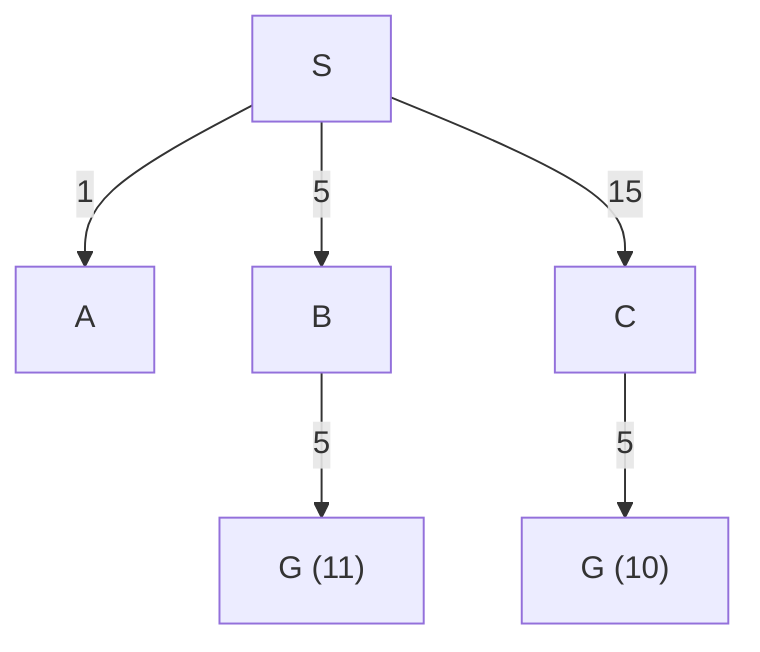
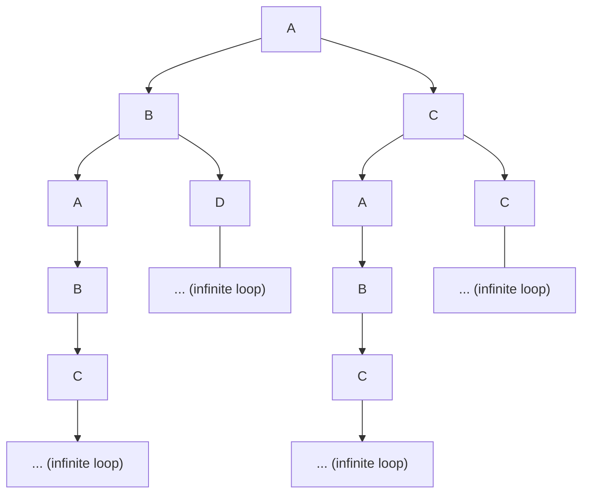
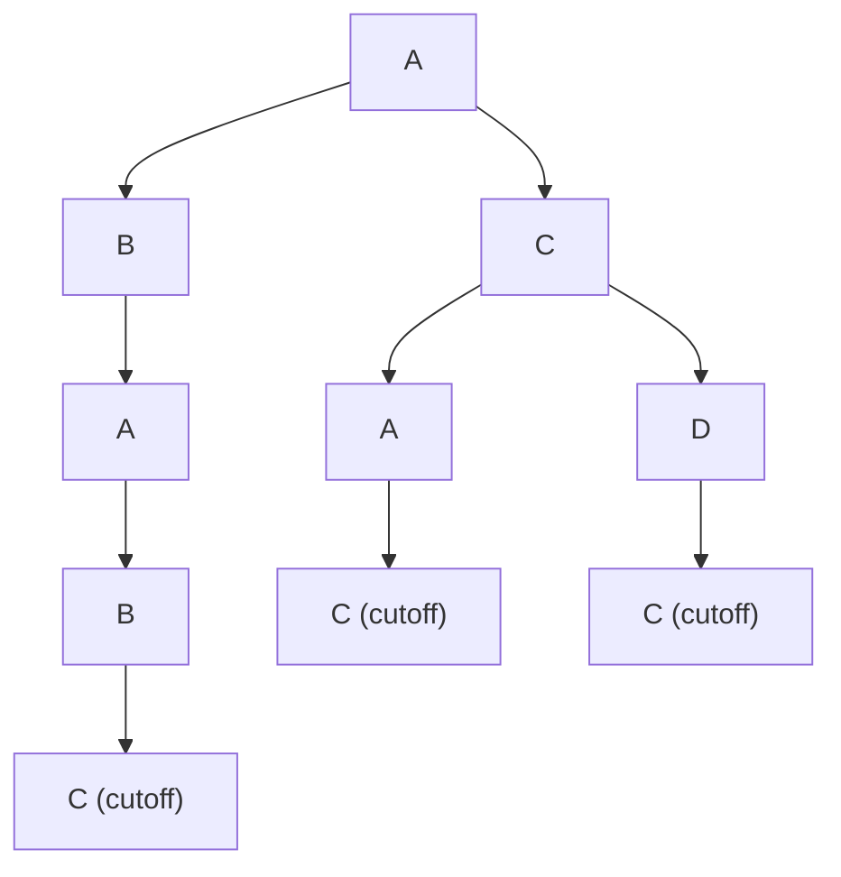

# AI Lec03 — Uninformed Search (2026)

> 📄 [View original PDF](documents/ai-lec03-uninformed-search-20260630.pdf) — source of truth

Artificial Intelligence
Instructor: Kietikul Jearanaitanakij
Department of Computer Engineering
King Mongkut's Institute of Technology Ladkrabang

Lecture 3
Uninformed Search
- Uninformed Search Strategies
- Breadth-First Search
- Uniform-Cost Search
- Depth-First Search
- Depth-Limited Search
- Iterative Deepening Search
- Bidirectional Search

---

### Search Strategies

There are two groups of search strategies:

1. **Uninformed Search (Blind Search)**
   The strategies have no additional information about states. All they can do is generate successors and distinguish a goal state from a non-goal state.

2. **Informed Search (Heuristic Search)**
   The strategies have useful information for searching. They know whether one non-goal state is "more potential" than another.

---

### 1. Breadth-First Search

Breadth-first search is a simple strategy in which the root node is expanded first, then all the successors of the root node are expanded next, then their successors, and so on. In general, all the nodes are expanded at a given depth in the search tree before any nodes at the next level are expanded.

> 📄 See [PDF page 6](documents/ai-lec03-uninformed-search-20260630.pdf#page=6)

<http://teleported.in/posts/ai-search-algorithms/>

Arad to Neamt

**Analysis of Breadth-First Search**

| Property | Value |
|---|---|
| Completeness | Yes |
| Optimality | Yes (in terms of steps) |
| Time complexity | In the worst case, it is the time spends to generate the last node. Then the total number of nodes generated is O(b^d) |
| Space complexity | There will be O(b^(d−1)) nodes in the explored set and O(b^d) nodes in the frontier. So the space complexity is O(b^d), i.e., it is dominated by the size of the frontier. |

*b is branching factor, d is depth of the solution*

Time and memory requirements for breadth-first search (scary, isn't it?)

How do time and space functions grow?

---

### 2. Uniform-Cost Search

When all step costs are not equal, the breadth-first search may not be optimal. The uniform-cost search expands the node n with the lowest path cost g(n).

Example:

```
Path_Cost(S->F->B) = 310
Path_Cost(S->R->P->B) = 278
```

Example: Start from S to goal G.



Frontier: 11 > 5, 10 < 15

> 📄 See [PDF page 11](documents/ai-lec03-uninformed-search-20260630.pdf#page=11)

<http://teleported.in/posts/ai-search-algorithms/>

Arad to Bucharest

**Analysis of Uniform-Cost Search**

| Property | Value |
|---|---|
| Completeness | Yes |
| Optimality | Yes |
| Time complexity | O(b^(1+⌊C*/∈⌋)) |
| Space complexity | O(b^(1+⌊C*/∈⌋)) |

Where:
- b is branching factor,
- C* is the optimal path cost,
- Every action costs at least ∈. If ∈ is small, the complexity will be high.


---

### 3. Depth-First Search

DFS always expands the deepest node in the current frontier of the search tree.

While Breadth-first-search uses a FIFO queue, depth-first search uses a LIFO queue (stack).

<http://teleported.in/posts/ai-search-algorithms/>

<https://youtu.be/sciGbuuBJ-M>

**Analysis of Depth-First Search**

| Property | Value |
|---|---|
| Completeness | No (if redundant states are allowed) |
| Optimality | No |
| Time complexity | O(b^d) |
| Space complexity | O(bd) => Good |

Where:
- b is branching factor,
- d is the max. depth of solution.



---

### 4. Depth-Limited Search

Incompleteness of DFS can be alleviated by a predetermined depth limit. The depth limit solves the infinite-path problem. DLS usually uses when we know the maximum solution depth of the problem.



Depth limit = 4 (Too small limit)

<http://teleported.in/posts/ai-search-algorithms/>

**Analysis of Depth-Limited Search**

| Property | Value |
|---|---|
| Completeness | Yes (if l ≥ maximum depth of the solution) |
| Optimality | No |
| Time complexity | O(b^l) |
| Space complexity | O(b^l) |

---

### 5. Iterative Deepening Search

(Iterative deepening depth-first search)

IDS iterates through the depth-limited search by gradually increasing the limit—first 0, then 1, then 2, and so on—until a goal is found.


Limit can be varied.

IDS combines the benefits of DFS and BFS. Like DFS, its memory requirements are modest: O(bd). Like BFS, it is complete when the branching factor is finite and optimal when the path cost is a nondecreasing function of the depth of the node.

> 📄 See [PDF page 22](documents/ai-lec03-uninformed-search-20260630.pdf#page=22)

<http://will.thimbleby.net/algorithms/doku.php?id=algorithm:iterative_deepening_depth-first_search>

<http://teleported.in/posts/ai-search-algorithms/>

Arad to Bucharest

- Iterative deepening search may seem wasteful because states are generated multiple times.
- It turns out this is not too costly.
- Reason:
- The number of nodes at the top level is small but expanded many times.
- In contrast, the number of nodes at the bottom level is largest but expanded only once.

In an iterative deepening search, the nodes on the bottom level (depth d) are generated once, those on the next-to-bottom level are generated twice, and so on, up to the children of the root, which are generated d times. So the total number of nodes generated in the worst case is

```
N(IDS) = (d+1)·1 + (d)·b + (d−1)·b² + ⋯ + (1)·bᵈ
```

which gives a time complexity O(b^d). However, there is some extra cost for generating the upper levels multiple times, but it is not large. For example, if b = 10 and d = 5, the numbers are

```
N(IDS) = 50 + 400 + 3,000 + 20,000 + 100,000 = 123,450
N(BFS) = 10 + 100 + 1,000 + 10,000 + 100,000 = 111,110
```

IDS is preferred when the search space is large, and the solution depth is unknown.

**Analysis of Iterative Deepening Search**

| Property | Value |
|---|---|
| Completeness | Yes |
| Optimality | Yes |
| Time complexity | O(b^d) |
| Space complexity | O(bd) |

---

### 6. Bidirectional Search

Idea: Run two simultaneous searches—one forward from the initial state and the other backward from the goal—hoping that the two searches meet in the middle. The motivation is that b^(d/2) + b^(d/2) is much less than b^d.

For each search on both sides, we can use either breadth-first search or iterative deepening search to reduce the space complexity.


Bidirectional Search Simulation: <https://www.youtube.com/watch?v=YtPT99c5OXc>

**Analysis of Bidirectional Search**

| Property | Value |
|---|---|
| Completeness | Yes |
| Optimality | Yes (if the cost for each action is equal & monotonically increasing) |
| Time complexity | O(b^(d/2)) |
| Space complexity | O(b^(d/2)) BFS, O(bd/2) IDS |


---

### Comparison of Uninformed Search Strategies

> 📄 See [PDF page 31](documents/ai-lec03-uninformed-search-20260630.pdf#page=31)
