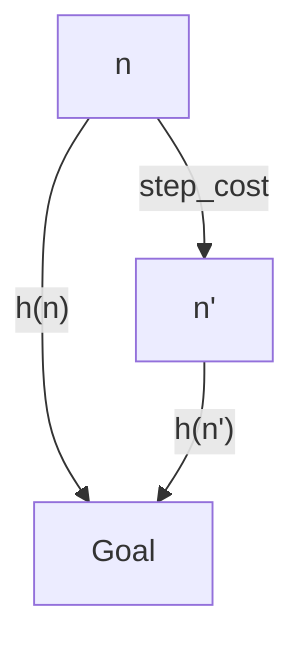
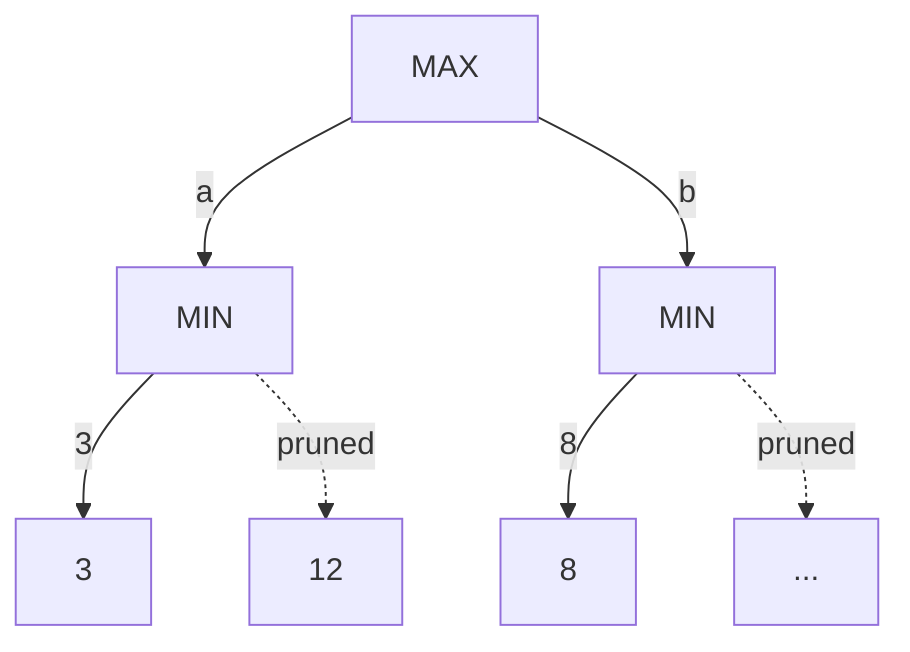

# AI Lec04 — Heuristic & Adversarial Search (2026)

> 📄 [View original PDF](documents/ai-lec04-heuristic-search-20260630.pdf) — source of truth

Artificial Intelligence
Instructor: Kietikul Jearanaitanakij
Department of Computer Engineering
King Mongkut's Institute of Technology Ladkrabang

Lecture 4
Heuristic & Adversarial Search
- Heuristic Search Strategies
- Optimal Decisions in Games
- Alpha-Beta Pruning

---

### Heuristic Search

- The traditional heuristic search uses an evaluation function f(n) to select a node to be expanded.
- Evaluation function f(n) = Heuristic function h(n) + Actual Path Cost g(n)
- Heuristic function h(n) provides a clue to guess which neighbor of a node will lead to a goal.

```
h(n) = estimated cost of the cheapest path from the state at node n to a goal state.
```

Where h(n) is nonnegative and h(n) = 0 if n is a goal state.

- The heuristic function is constructed as a cost estimate, so the node with the lowest heuristic value is expanded first.
- Heuristic search selects a node to be expanded by the uniform-cost search.

```
Start --[g(n)]--> n --[h(n)]--> Goal
```

---

### 1. Greedy Best-First Search

f(n) = h(n) + g(n)

- Expand the node that tends to be closest to the goal.
- It evaluates nodes by using just the heuristic function, i.e., f(n) = h(n).
- In the route-finding problems in Romania, we can use the straight-line distance heuristic, hSLD.
- Good heuristic function never overestimates the actual cost.

```
n --[h(n) estimated cost]--> Goal
    --[actual cost]-------->
```

> 📄 See [PDF page 6](documents/ai-lec04-heuristic-search-20260630.pdf#page=6)

Actual cost = 140 + 99 + 211 = 450

Searching from Arad to Bucharest by using greedy best-first search

However, Arad → Sibiu → Rimnicu → Pitesti → Bucharest takes lower actual cost: 140 + 80 + 97 + 101 = 418

**(Greedy search is not optimal!)**

Searching from Arad to Bucharest by using greedy best-first search

Greedy best-first search is also incomplete.

```
Iasi → Neamt → Iasi → Neamt → Vaslui → Iasi → ... (Infinite loop)
Start ------------------------------> Goal
```

Time & Space Complexities = O(b^m)

Where m is the max depth of the search space.

---

### 2. A\* Search ("A-star search")

It evaluates nodes by combining g(n), the path cost to reach the node n, and h(n).

```
f(n) = h(n) + g(n)

Start --[g(n)]--> n --[h(n)]--> Goal

f(n) = estimated cost of the cheapest solution through n.
```

**Conditions for optimality of A\* search**

1. h(n) must be an **admissible heuristic**.

   An admissible heuristic is one that never overestimates the cost to reach the goal. Ex: Straight-line distance is admissible because it is the shortest path between any two points.

2. h(n) must be **consistent** (monotonicity).

   ```
   h(n) <= step_cost(from n to n') + h(n')
   ```

   A heuristic h(n) is consistent if, for every node n and every successor n' of n, the estimated cost of reaching the goal from n is no greater than the step cost of getting to n' plus h(n').



> ⚠️ Consistency condition: **h(n) ≤ step_cost(from n to n') + h(n')**

Actual cost = 140 + 80 + 97 + 101 = 418

Searching from Arad to Bucharest by using A\* search

**A\* search is optimal!**

g(Arad) = 0, h(Arad) = 366
f = g + h

<http://teleported.in/posts/ai-search-algorithms/>

Contour plots at f = 380, f = 400, and f = 420, with Arad as the start state. All contours have a similar direction toward the goal state (B). Hence, A\* search is complete.

However, A\* may not be suitable for large-scale problems since it has bad computation time and space complexity.

---

### Examples of Heuristic Function

**8-puzzle problem**

- **h1** = the number of misplaced tiles. h1 is an admissible heuristic because it is clear that any tile that is out of place must be moved at least once.
- **h2** = the sum of the distances of the tiles from their goal positions. Manhattan (city block) distance is the sum of the horizontal and vertical distances.

```
h1 = 8
h2 = 3 + 1 + 2 + 2 + 3 + 2 + 2 + 3 = 18
```

h2 is better than h1, and is far better than using iterative deepening search.

---

### Local Search Algorithms and Optimization Problems

- In many problems, however, the path to the goal is irrelevant. For example, in the 8-queens problem, what matters is the final configuration of queens, not the order in which they are added.
- Other examples are IC design, factory-floor layout, job scheduling, automatic programming, telecommunications network optimization, vehicle routing, and portfolio management.
- Local search algorithms operate using a single current node and move to its neighbors.

- Although local search algorithms are not systematic, they have two key advantages:
  1. They use very little memory—usually a constant amount; and
  2. They can often find reasonable solutions in large or infinite (continuous) state spaces for which systematic algorithms are unsuitable.

- Local search algorithms are useful for solving pure optimization problems, in which the aim is to find the best state according to an objective function.

---

### State-Space Landscape

A one-dimensional state-space landscape. The aim is to find the global maximum.

---

### Local Search: Hill-Climbing Search

The hill-climbing search algorithm (steepest-ascent version) is simply a loop that continually moves in the direction of increasing value—that is, uphill. It terminates when it reaches a "peak" where no neighbor has a higher value.

The algorithm does not maintain a search tree, so the data structure for the current node need only record the state and the value of the objective function.

**Example of using hill-climbing search**

- A state formulation: each state has 8 queens on the board, one per column.
- The successors of a state are all possible states generated by moving a single queen to another square in the same column (so each state has 8 × 7 = 56 successors).
- Heuristic cost function h is the number of pairs of queens that are attacking each other.

```
h = 1
```

h = 17

- The figure shows the values of all its successors, with the best successors having h = 12. (8 best successors which have h = 12)
- Hill-climbing algorithms typically choose randomly among the set of best successors if there is more than one.
- Hill climbing is sometimes called greedy local search because it grabs a good neighbor state without thinking ahead about where to go next.

**Unfortunately, hill climbing often gets stuck for the following reasons:**

1. **Local maxima**: a local maximum is a peak that is higher than each of its neighboring states but lower than the global maximum.

   This state is a local maximum (i.e., a local minimum for cost h); every move of a single queen makes the situation worse.

   ```
   h = 1
   ```

2. **Ridges**: Ridges result in a sequence of local maxima that is very difficult for greedy algorithms to navigate.

   ```
   Very tiny angle → Very tiny height improvement
   ```

3. **Plateaux**: A flat area of the state-space landscape. An agent searches without direction back and forth. It might get lost in the plateau forever.

   ```
   Erratically walk
   ```

---

### Simulated Annealing Search

A hill-climbing algorithm never makes "downhill" moves. It tends to get stuck in a local maximum.

Simulated annealing: Annealing is the process of hardening metals (or glass) by heating them to a high temperature and then gradually cooling them, thus allowing the material to reach the optimal state.

```
t (time)    T (Temperature)
1           T_Max
2           T_Max * 0.98
3           T_Max * (0.98^2)
4           T_Max * (0.98^3)
…           …
t_MAX       Approach 0

schedule: e^(−|∆E / T|)
```

> 📄 See [PDF page 29](documents/ai-lec04-heuristic-search-20260630.pdf#page=29)

---

### Local Beam Search

- The local beam search algorithm keeps track of k states rather than just one.
- It begins with k randomly generated states. At each step, all the successors of all k states are generated.
- If anyone is a goal, the algorithm halts. Otherwise, it selects the k best successors from the complete list and repeats.
- However, they quickly become concentrated in a small region of the state space.

---

### MINIMAX Game

- We consider games with two players, whom we call MAX and MIN.
- MAX moves first, and then they take turns moving until the game is over.
- At the end of the game, points are awarded to the winning player, and penalties are given to the loser.

**Example: Tic-Tac-Toe**

- From the initial state, MAX has nine possible moves. Play alternates between MAX's placing an X and MIN's placing an O.
- The number on each leaf node indicates the utility value of the terminal state from the point of view of MAX; high values are assumed to be good for MAX and bad for MIN (which is how the players get their names).

> 📄 See [PDF page 32](documents/ai-lec04-heuristic-search-20260630.pdf#page=32)

---

### Optimal Decisions in Games

Let's simplify the scenario of the two-ply game tree as follow:

- The △ nodes are "MAX nodes."
- The ▽ nodes are "MIN nodes."
- MAX's best move at the root is a1, because it leads to the state with the highest minimax value, and MIN's best reply is b1, because it leads to the state with the lowest minimax value.

We can derive the value of MINIMAX(s) of each state s by applying the following formula.

```
MINIMAX(root) = max( min(3, 12, 8), min(2, 4, 6), min(14, 5, 2) )
              = max( 3, 2, 2 )
              = 3
```

**Optimal decisions in multiplayer games**

- Vector stores utility value of each player.
- All players try to maximize their utility values.

---

### Alpha–Beta Pruning



---

### Stochastic Games

- Backgammon is a typical game that combines luck and skill.
- Dice are rolled at the beginning of a player's turn to determine the legal moves.
- The goal of the game is to move all one's pieces off the board.
- White moves clockwise toward 25, and Black moves counterclockwise toward 0.
- A piece can move to any position unless multiple opponent pieces are there; if there is one opponent, it is captured and must start over.

Backgammon tutorial by Bucky: <https://youtu.be/h0D0bQE_Lfc>

> 📄 See [PDF page 38](documents/ai-lec04-heuristic-search-20260630.pdf#page=38)

Where r represents a possible dice roll (or other chance event) and RESULT(s, r) is the same state as s, with the additional fact that the result of the dice roll is r.

- Although White knows what his or her own legal moves are, White does not know what Black is going to roll and thus does not know what Black's legal moves will be.
- That means White cannot construct a standard game tree of the sort we saw in chess and tic-tac-toe.
- A CHANCE NODES game tree in backgammon must include chance nodes in addition to MAX and MIN nodes.
