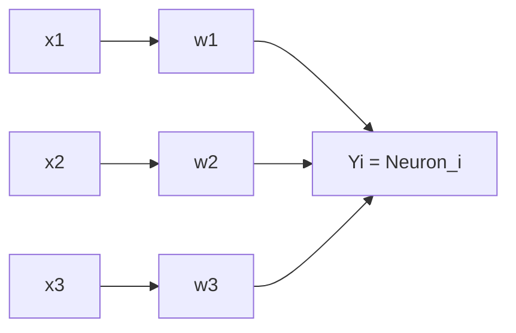

# AI Lec09 — Perceptron and Artificial Neural Networks (2026)

> 📄 [View original PDF](documents/ai-lec09-perceptron-neural-nets-20260630.pdf) — source of truth

Artificial Intelligence
Instructor: Kietikul Jearanaitanakij
Department of Computer Engineering
King Mongkut’s Institute of Technology Ladkrabang

---

**Lecture 9 — Perceptron and Artificial Neural Networks**

- Linear Classification With Perceptron
- Perceptron learning algorithm
- Multilayer neural networks
- Backpropagation for multilayer NN

---

### Perceptron

- Perceptron is a computation unit that imitates a biological neuron.
- Dendrite receives an input signal.
- Axon sends signals out to other neurons.

---

> 📄 See [PDF page 4](documents/ai-lec09-perceptron-neural-nets-20260630.pdf#page=4) — Inside a Perceptron diagram

---

### Perceptron at an Early Stage



Perceptron consists of a single neuron with adjustable weights and a hard limit activation function.

Frank Rosenblatt invented perceptron in 1957.

There are many kinds of activation functions.

---

### Activation Functions

| Name | Equation | Plot |
|------|----------|------|
| Identity (Linear) | — | — |
| Binary step | — | — |
| Sigmoid (Logistic) | — | — |
| TanH (Hyperbolic Tan) | — | — |
| Softmax | For classification problems. | — |

> 📄 See [PDF page 6](documents/ai-lec09-perceptron-neural-nets-20260630.pdf#page=6) for activation function plots

---

### Linear Separability

Data is linearly separable if there is a hyperplane that separates their instances into 2 classes.

In general, the hyperplane is defined by the linearly separable function:

```
x1·w1 + x2·w2 - θ = 0
```

In general: Σ(i=1 to n) xᵢwᵢ − θ = 0

The threshold θ is used to shift the decision boundary up and down (vertical intercept).

---

### Perceptron Learning

- The perceptron learns its classification by making small adjustments in the weights to reduce the error between the actual and target outputs of the perceptron.

```
e(p) = Yd(p) − Y(p)
```

Where:
- p is the training pattern (example)
- Yd(p) is the target output of pattern p
- Y(p) is the actual output
- e(p) is the error between Yd(p) and Y(p)

- It uses e(p) to update weights of the next iteration:

```
wᵢ(p + 1) = wᵢ(p) + α · xᵢ(p) · e(p)
```

where α is the learning rate (0~1).

---

### Perceptron Learning Algorithm

**Step 1: Initialization**

Set initial weights w₁, w₂, …, wₙ and thresholds (θ) to small random numbers in the range [-0.5, +0.5]. p = 1 (the first pattern).

**Step 2: Activation**

```
Y(p) = step( Σ(i=1 to n) xᵢ(p) · wᵢ(p) − θ )
```

where n is the number of perceptron inputs. (Step function)

**Step 3: Weight training by using gradient descent**

```
wᵢ(p + 1) = wᵢ(p) + Δwᵢ(p)
Δwᵢ(p) = α · xᵢ(p) · e(p)
```

where `e(p) = Yd(p) − Y(p)`

---

**Step 4: Iteration**

Increase p by one, go back to step 2 until each pattern is trained.

**Step 5:**

If the perceptron doesn't converge, p = 1 and repeat steps 2–4.

---

### Example: Train a Perceptron on AND Operator

θ = 0.3, α = 0.1

| Epoch | Inputs x₁ x₂ | Yd (desired) | Weights w₁ w₂ | Y (actual) | Error | New Weights w₁ w₂ |
|-------|-------------|-------------|---------------|-----------|-------|-------------------|
| 1 | 0 0 | 0 | 0.3 -0.1 | 0 | 0 | 0.3 -0.1 |
| 1 | 0 1 | 0 | 0.3 -0.1 | 0 | 0 | 0.3 -0.1 |
| 1 | 1 0 | 0 | 0.3 -0.1 | 1 | -1 | 0.2 -0.1 |
| 1 | 1 1 | 1 | 0.2 -0.1 | 0 | 1 | 0.3 0.0 |
| 2 | 0 0 | 0 | 0.3 0.0 | 0 | 0 | 0.3 0.0 |
| 2 | 0 1 | 0 | 0.3 0.0 | 0 | 0 | 0.3 0.0 |
| 2 | 1 0 | 0 | 0.3 0.0 | 1 | -1 | 0.2 0.0 |
| 2 | 1 1 | 1 | 0.2 0.0 | 1 | 0 | 0.2 0.0 |
| … | … | … | … | … | … | … |
| 5 | 0 0 | 0 | 0.1 0.1 | 0 | 0 | 0.1 0.1 |
| 5 | 0 1 | 0 | 0.1 0.1 | 0 | 0 | 0.1 0.1 |
| 5 | 1 0 | 0 | 0.1 0.1 | 0 | 0 | 0.1 0.1 |
| 5 | 1 1 | 1 | 0.1 0.1 | 1 | 0 | 0.1 0.1 |

---

### Problem of a Perceptron

- Perceptron can learn only simple linear separable problems, e.g., AND, OR. It failed on XOR problem.
- A single perceptron can classify only linear separable problems, regardless of whether we use hard-limit or soft-limit activation functions.
- Moreover, increasing the number of perceptrons in the same layer doesn't help.

---

### Multilayer Neural Networks

- Input layer accepts input signals and distributes these signals to all neurons in the next hidden layer.
- Hidden layers detect the features of the input patterns by adjusting the weights of the neurons.
- Output layer accepts signals from the hidden layer and predicts the output class.
- Multilayer neural networks can solve the non-linearly separable problem.

---

### Nonlinearly Separable Problem

| AND | OR | XOR |
|-----|----|-----|
| Linearly separable | Linearly separable | **Non-linearly separable** |

> 📄 See [PDF page 14](documents/ai-lec09-perceptron-neural-nets-20260630.pdf#page=14) for decision boundary diagrams

---

### Choosing Hidden Layers and Neurons

- The criteria for choosing the number of hidden layers and neurons depends on the problem's complexity.
- Good practice is to start with a low number of them and gradually increase until the network can learn the patterns.
- Most practical applications use a three-layer neural network (1-1-1: input-hidden-output).
- The most popular learning algorithm is **Backpropagation**.

Each neuron determines its output Y as:

```
X = Σ(i=1 to n) xᵢwᵢ − θ
y = 1 / (1 + e⁻ˣ)   ; 0 < y < 1  (Sigmoid)
```

---

> 📄 See [PDF page 16](documents/ai-lec09-perceptron-neural-nets-20260630.pdf#page=16) — Forward computation and backpropagation network diagram

---

### Backpropagation for Multilayer NN

- To propagate error signals, we start at the output layer and work backward to the hidden layer.
- The error signal at the output of neuron k at iteration p is defined by:

```
eₖ(p) = yₐₖ(p) − yₖ(p)
```

Where `yₐₖ(p)` is the desired output of neuron k at iteration p.

---

**Weight update (output layer):**

```
wⱼₖ(p + 1) = wⱼₖ(p) + Δwⱼₖ(p)
Δwⱼₖ(p) = α · yⱼ(p) · δₖ(p)
```

**Error gradient at neuron k:**

```
δₖ(p) = ∂yₖ(p)/∂Xₖ(p) · eₖ(p)
```

For a sigmoid activation function (yₖ = 1/(1 + e⁻ˣᵏ)):

```
∂yₖ(p)/∂Xₖ(p) = e⁻ˣᵏ⁽ᵖ⁾ / (1 + e⁻ˣᵏ⁽ᵖ⁾)²
               = yₖ(p) · (1 − yₖ(p))
```

---

**Weight update (hidden layer):**

```
wᵢⱼ(p + 1) = wᵢⱼ(p) + Δwᵢⱼ(p)
Δwᵢⱼ(p) = α · xᵢ(p) · δⱼ(p)
```

```
δⱼ(p) = yⱼ(p) · (1 − yⱼ(p)) · Σ(q=1 to l) [δₖq(p) · wⱼₖq(p)]
```

Where l is the number of neurons in the output layer.

---

### Complete Training Algorithm

**Step 1: Weights Initialization**

Set all weights and thresholds (θ) to random numbers uniformly distributed inside a small range, e.g., (-0.5, +0.5).

**Step 2: Activation (Feedforward computation)**

Calculate the actual outputs of neurons in the **hidden layer**:

```
yⱼ(p) = sigmoid( Σ(i=1 to n) xᵢ(p) · wᵢⱼ(p) − θⱼ )
```

Where n is the number of inputs of neuron j in the hidden layer.

---

Calculate the actual outputs of neurons in the **output layer**:

```
yₖ(p) = sigmoid( Σ(j=1 to m) xⱼ(p) · wⱼₖ(p) − θₖ )
```

Where m is the number of inputs of neuron k in the output layer.

---

**Step 3: Weight training (Backpropagation)**

Calculate the error gradient of neurons in the **hidden-output layer**:

```
eₖ(p) = yₐₖ(p) − yₖ(p)
δₖ(p) = yₖ(p) · (1 − yₖ(p)) · eₖ(p)
Δwⱼₖ(p) = α · yⱼ(p) · δₖ(p)
wⱼₖ(p + 1) = wⱼₖ(p) + Δwⱼₖ(p)
```

Calculate the error gradient of neurons in the **input-hidden layer**:

```
δⱼ(p) = yⱼ(p) · (1 − yⱼ(p)) · Σ(k=1 to l) δₖ(p) · wⱼₖ(p)
Δwᵢⱼ(p) = α · xᵢ(p) · δⱼ(p)
wᵢⱼ(p + 1) = wᵢⱼ(p) + Δwᵢⱼ(p)
```

---

**Step 4: Iterations**

- Take the next training pattern, p+1, and go back to step 2. Then repeat the process until the selected error criterion is satisfied.
- A simple stop criterion is when the sum-squared error (SSE) is less than a certain number, e.g., 0.1.

```
SSE = Σ(p=1 to #patterns) Σ(k=1 to #outputs) (yₐₖ(p) − yₖ(p))²
```

---

### Example: 3-Layer NN for XOR Problem

Recall that a single-layer perceptron cannot solve XOR problem.

> 📄 See [PDF page 24](documents/ai-lec09-perceptron-neural-nets-20260630.pdf#page=24) — 3-layer XOR network architecture

> 📄 See [PDF page 25](documents/ai-lec09-perceptron-neural-nets-20260630.pdf#page=25) — XOR network with initial weights

---

**All weights and thresholds are randomly initialized as follows:**

| Parameter | Initial Value |
|-----------|--------------|
| w₁₃ | 0.5 |
| w₁₄ | 0.9 |
| w₂₃ | 0.4 |
| w₂₄ | 1.0 |
| w₃₅ | -1.2 |
| w₄₅ | 1.1 |
| θ₃ | 0.8 |
| θ₄ | -0.1 |
| θ₅ | 0.3 |

---

**Forward computation for training pattern ⟨1, 1, 0⟩:**

```
y₃ = 1 / (1 + e^(−(1·0.5 + 1·0.4 − 1·0.8))) = 0.5250
y₄ = 1 / (1 + e^(−(1·0.9 + 1·1.0 + 1·0.1)))  = 0.8808
y₅ = 1 / (1 + e^(−(−0.525·1.2 + 0.8808·1.1 − 1·0.3))) = 0.5097

e = yₐ₅ − y₅ = 0 − 0.5097 = −0.5097

δ₅ = y₅ · (1 − y₅) · e
   = 0.5097 · (1 − 0.5097) · (−0.5097)
   = −0.1274
```

---

**Weight updates (α = 0.1):**

```
Δw₃₅ = α · y₃ · δ₅ = 0.1 · 0.5250 · (−0.1274) = −0.0067
Δw₄₅ = α · y₄ · δ₅ = 0.1 · 0.8808 · (−0.1274) = −0.0112
Δθ₅  = α · (−1) · δ₅ = 0.1 · (−1) · (−0.1274) = 0.0127
```

**Error gradients for hidden neurons:**

```
δ₃ = y₃ · (1 − y₃) · δ₅ · w₃₅ = 0.525 · (1 − 0.525) · (−0.1274) · (−1.2) = 0.0381
δ₄ = y₄ · (1 − y₄) · δ₅ · w₄₅ = 0.8808 · (1 − 0.8808) · (−0.1274) · 1.1 = −0.0147
```

---

**Updating input-hidden weights:**

```
Δw₁₃ = α · x₁ · δ₃ = 0.1 · 1 · 0.0381 = 0.0038
Δw₂₃ = α · x₂ · δ₃ = 0.1 · 1 · 0.0381 = 0.0038
Δθ₃  = α · (−1) · δ₃ = 0.1 · (−1) · 0.0381 = −0.0038

Δw₁₄ = α · x₁ · δ₄ = 0.1 · 1 · (−0.0147) = −0.0015
Δw₂₄ = α · x₂ · δ₄ = 0.1 · 1 · (−0.0147) = −0.0015
Δθ₄  = α · (−1) · δ₄ = 0.1 · (−1) · (−0.0147) = 0.0015
```

---

**Final updated weights:**

```
w₁₃ = 0.5 + 0.0038 = 0.5038
w₁₄ = 0.9 − 0.0015 = 0.8985
w₂₃ = 0.4 + 0.0038 = 0.4038
w₂₄ = 1.0 − 0.0015 = 0.9985
w₃₅ = −1.2 − 0.0067 = −1.2067
w₄₅ = 1.1 − 0.0112 = 1.0888
θ₃  = 0.8 − 0.0038 = 0.7962
θ₄  = −0.1 + 0.0015 = −0.0985
θ₅  = 0.3 + 0.0127 = 0.3127
```

---

> 📄 See [PDF page 31](documents/ai-lec09-perceptron-neural-nets-20260630.pdf#page=31) — SSE vs. Epoch convergence graph

- Repeat the same computation for all training patterns (1 epoch)
- Repeat the process for another epoch until the sum of squared error (SSE) is less than a certain number, e.g. 0.001.

---

### Final Network Results (SSE = 0.0010)

| x₁ | x₂ | yd | y₅ | e | SSE |
|----|----|----|------|--------|------|
| 0 | 1 | 1 | 0.9849 | 0.0151 | 0.0010 |
| 1 | 0 | 1 | 0.9849 | 0.0151 | |
| 0 | 0 | 0 | 0.0175 | -0.0175 | |
| 1 | 1 | 0 | 0.0155 | -0.0155 | |

Sum of squared errors (SSE) of the final network.
