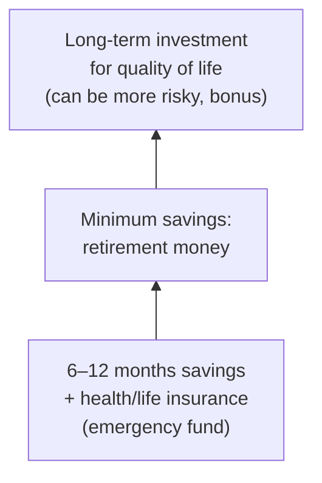

# Investment Lec02 — Personal Finance, Risk & Return (2026)

> 📄 [View original PDF](documents/investment-lec02-personal-finance-risk-20260709.pdf) — source of truth  
> ⚠️ Many slides in this lecture are image-based diagrams and charts that could not be extracted as text. The content below has been supplemented with context where needed.

Investment Planning (96643026)
9 July 2026

---

## Table of Content

1. Status Check before investing
2. Risks and their definition
3. Rate of Return
4. External factors that affect investment
5. Internal Investment Factors
6. Explanation of the self-assessment form

---

## 1. Status Check Before Investing

> 💬 **Warren Buffett:** "Don't invest in something you don't understand."
>
> 📄 See [PDF page 3](documents/investment-lec02-personal-finance-risk-20260709.pdf#page=3) — Warren Buffett quote.

### Check Your Financial Status Before You Start Investing

> 📄 See [PDF page 7](documents/investment-lec02-personal-finance-risk-20260709.pdf#page=7) — financial status checklist diagram.

### Money Management Guidelines



**Income > Expenses** → Emergency Reserves → Difference (invest)

**Income − Savings = Expenses** — Set a goal for retirement.

### Key Principles

- **Invest ≠ Speculate**
- Risk Management
- Diversification
- Financial discipline
- Pay attention and follow relevant news

### Sources of News & Information

To stay informed as an investor, regularly follow financial news from reliable sources:

| Source | Type |
|---|---|
| Bloomberg, CNBC, Reuters | International financial news |
| Stock Exchange of Thailand (SET) | Thai market data, listed company info |
| SEC (Securities and Exchange Commission) | Regulatory filings, fund info |
| Bank of Thailand | Monetary policy, interest rates, economic data |
| Investing.com, TradingView | Market data, charts, technical analysis |
| Yahoo Finance, Finnomena, Jitta | Portfolio tracking, stock analysis (Thai market) |
| Dime, Settrade | Trading platforms popular in Thailand |

> 📄 See [PDF pages 4–6](documents/investment-lec02-personal-finance-risk-20260709.pdf#page=4) — sources of news slides.

---

## Understand Investment Assets

### Starting Out

**Debt Management:**
- School loans, automobiles, house

**Cash Reserves:**
- 3–6 months of net income in cash, money market, or short-term bond fund

### Debt Benchmarks

- Monthly housing costs (principal, interest, taxes, insurance) should be **≤ 28% of gross income**.

### Debt Pitfalls Early in Career

- Too much house → you may have to move
- Too much car → you don't deserve it
- Too much credit card debt → restaurants, vacations, furniture

> Mortgage debt's interest is tax deductible and hopefully your home will appreciate.

---

### Investment Assets Overview

| Asset Class | Key Characteristics |
|---|---|
| **Bank Deposits** | Return ~1%, negligible risk, liquid as cash, cannot beat inflation |
| **Fixed Income / Bonds** | Historically ~5–6% return. Short-term (≤1yr), Intermediate (2–10yr), Long-term (>10yr). Affected by interest rate, reinvestment, default, and inflation risks. |
| **Equities / Common Shares** | Most volatile — greatest risk, greatest rewards. S&P 500 ~12.02% since 1980. Thai SET50 ~3.44% since 1995. |
| **Alternative Assets** | Real estate, REITs, precious metals, digital currencies, commodities |

### Bank Deposits / Money Markets

- Return is low (~1%) but risk is negligible
- Most funds consist of Thai Govt. Bonds and U.S. Treasury issues / AAA corporate securities
- Maturity < 270 days
- Considered as liquid as cash
- **Cannot beat inflation**

### Bonds

- Historically returned ~5–6%
- Categories: Short term (≤1 yr), Intermediate (2–10 yr), Long term (>10 yr)
- Credit grade affects price and return (Treasury = highest grade, lowest return; junk bonds = lowest grade, highest return/risk)
- Affected by: interest rate risk, reinvestment rate risk, default risk, purchasing power/inflation risk
- If selected carefully, **can beat inflation**

### Equities

- Primarily common stock
- Best performing asset class over the past 20 years (especially in low inflation)
- Dividends have become less important
- Most volatile (greatest risk, greatest rewards)
- S&P 500: ~12.02% annualized since 1980 (with several crashes)
- Thai SET50: ~3.44% annualized since 1995; lost ~0.5% per year in past 5 years

#### Types of Stocks

| Type | Description | Examples |
|---|---|---|
| **Growth** | Fast-growing companies, limited equity, rapidly increasing cash | Amazon, Google, THG, CPF |
| **Value** | Older companies, may have dividends, not currently in favor | General Electric, PTT, SCC |
| **Equity Income** | Good dividends, stable companies | BATS, PTTEP |

#### Hedge Funds

- Use exotic instruments, tend to short markets and use leverage
- Did well during bubble bursting but can be "squeezed"
- High net worth individuals only — managers take first 20% of profit

### Alternative Investments — Real Estate

- Your home (usually a first investment)
- Rental property (headache unless professionally managed)
- **REITs** (Real Estate Investment Trusts): equity or mortgage based, must pay out 90% of annual income, can diversify portfolio

### Digital Currencies & Precious Metals

- Gold was significant in international currency stability pre-1974 (Bretton Woods)
- Free global markets have replaced the gold standard
- Platinum and silver are commodities rather than investment vehicles
- ⚠️ A lot of risks involved — be careful!

---

## 2. Investment Risks

### Definitions

- **Risk:** The uncertainty that may occur in the future — possibility of mistakes, damages, or adverse events.
- **Investment Risk:** The uncertainty or possibility of not receiving the expected return.

### Five Categories of Risk

| Risk Type | Description |
|---|---|
| **Market Risk** | Changes in overall market conditions affecting all asset prices (e.g., sluggish domestic economy) |
| **Business Risk** | Nature of the business — industry segment factors or company's internal operations affecting profitability |
| **Liquidity Risk** | Inability to sell assets immediately when cash is needed, or having to lose money to convert to cash |
| **Interest Rate Risk** | Fluctuations in market interest rates affecting asset prices and desired return levels |
| **Inflation Risk** | Purchasing power erosion — returns less than inflation reduce real value of money |

> **"High Risk, High (Expected) Return"** — High risk means possibility of greater profit, but also chance of large losses.

### Risk from an Economic Perspective

Risk = Volatility, measured by **Standard Deviation (S.D.)**

- High S.D. = Very risky
- Low S.D. = Less risk

> 📄 See [PDF page 32](documents/investment-lec02-personal-finance-risk-20260709.pdf#page=32) — Global Risk Rankings diagram.

---

## 3. Rate of Return / Return on Investment

### Components of Return

| Component | Examples |
|---|---|
| **Cash Flow** | Interest, Dividends, Rent |
| **Price Differentials** | Capital Gain / Loss |

### How to Calculate Yield/Return

#### (1) Realized Return — HPR (Holding Period Return)

Returns received over the investment period, regardless of holding period:

```
HPR = (End-of-Period Value − Initial Investment + Dividends) / Initial Investment
```

**Example:** Buy 1,000 ABC shares at 60 THB (60,000 THB). Receive 2 THB/share dividend annually for 5 years (2,000 × 5 = 10,000 THB). Sell all at 65 THB/share (65,000 THB).

```
HPR = (65,000 − 60,000 + 10,000) / 60,000 = 25%
```

#### (2) Average Return

Arithmetic mean, Geometric mean (compounded).

---

## 4–5. Investment Risk Factors

### External Factors (we have no control)

**PESTEL Analysis:** Political, Economic, Social, Technological, Legal, Environmental

Includes: economic conditions, social trends, political stability, technology changes, extreme events (COVID-19, inflation, war)

### Internal Factors

Business performance (profit growth/loss vs. analyst), business expansion, business outlook, SWOT, Five Forces, executive quality

---

## 6. Self-Assessment: Know Your Risk Tolerance

Before investing, you should understand your own risk profile. A **suitability test** (risk tolerance questionnaire) helps determine:

- Your **investment horizon** — how long can you leave money invested?
- Your **risk capacity** — how much loss can you financially absorb?
- Your **risk tolerance** — how comfortable are you emotionally with volatility?
- Your **investment objective** — growth, income, or capital preservation?

Based on results, investors are typically classified as:

| Profile | Approach | Suitable Assets |
|---|---|---|
| **Conservative** | Low risk, capital preservation | Bank deposits, money market, government bonds |
| **Moderate** | Balanced risk-reward | Mix of bonds and blue-chip equities, mutual funds |
| **Aggressive** | High risk, high growth potential | Growth stocks, derivatives, crypto, alternative assets |

> 📄 See the PDF for the full self-assessment form.

---

> 💬 **Albert Einstein (attributed):** "Compound interest is the 8th wonder of the world."
>
> 📄 See [PDF page 52](documents/investment-lec02-personal-finance-risk-20260709.pdf#page=52) — compound interest quote.

---

## The Magic Number: Rule of 72

> 📄 See [PDF page 57](documents/investment-lec02-personal-finance-risk-20260709.pdf#page=57) — Rule of 72 diagram.

To estimate how many years it takes to **double your money**:

```
Years to double = 72 / Annual Return Rate (%)
```

**Reverse:** To find the return needed to double in N years:

```
Required Return = 72 / N
```

---

## Summary

- Investment risk = return not as expected — could be better or worse — measured by S.D.
- HPR = actual/realized return; Arithmetic & Geometric mean for average returns
- Rule of 72 for estimating doubling time
- Internal factors: business performance, expansion, SWOT, Five Forces, executives
- External factors: PESTEL — economic, social, political, technology
