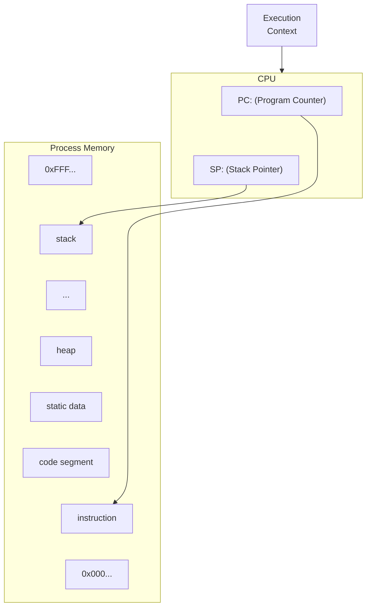
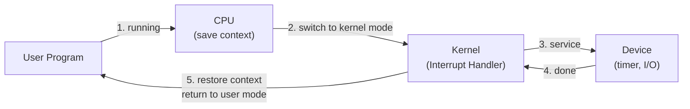
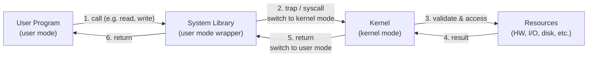

# OS Lec02 — Process & Context Switch, Part I: The Kernel Abstraction (2026)

> 📄 [View original PDF](documents/os-lec02-process-context-switch-20260717.pdf) — source of truth  
> ⚠️ Slides adopted from CSE 451 (UW), CS162 (UC Berkeley), and CSE 421/521 (UB). The original lecture slides are intentionally sparse — the professor expects students to take notes during class. Several diagrams have been reconstructed from the original PDF. The content below has been supplemented with explanations to make this summary self-contained.

Operating Systems — 2569/2026

---

## Computer Hardware (PC)

A typical personal computer is assembled from components made by **different manufacturers** — Intel or AMD for the CPU, NVIDIA or AMD for the GPU, Realtek or Intel for networking, various vendors for storage controllers, and so on. Each of these components speaks a different "language" (instruction set, register layout, I/O protocol).

- Parts come from **different manufacturers** with different instruction sets
- Different versions of hardware exist
- **Problem:** Without a common abstraction, an app must be developed for each specific hardware configuration — there is no universal app that runs everywhere

> 📄 See [PDF page 4](documents/os-lec02-process-context-switch-20260717.pdf#page=4) — the abstraction layers: Software → Library → Driver → Hardware.

> ⚠️ The diagram in the PDF labels the layers as Software, Lib, Driver, Hardware — no mention of "device driver", just "driver".

In other words: a game written for an NVIDIA GPU would not work on an AMD GPU, and a program compiled for an Intel CPU would not run on an ARM processor — unless there is an OS that translates between them.

---

## Question #1: How to deal with hardware variety?

> 📄 See [PDF page 3](documents/os-lec02-process-context-switch-20260717.pdf#page=3) — the question slide.

**Answer: The OS as an abstraction layer.**

The solution is a **layered architecture**. Rather than letting every application talk directly to hardware, the OS inserts itself between them as a set of nested abstraction layers:

- **Hardware** (bottom, widest): the physical components — CPU, memory, disks, I/O devices. Every layer above ultimately depends on it.
- **Driver**: software that translates between a specific piece of hardware and a standard interface. Each device (GPU, network card, disk controller) has its own driver.
- **Library**: reusable code that applications call — provides common functions (file I/O, networking, graphics) so programmers don't reinvent the wheel.
- **Software** (top, narrowest): the application or user program. It can reach down through any layer — calling library functions, which invoke drivers, which operate hardware.

The diagram below shows how each layer wraps the one above it — Hardware is the outermost because every operation ultimately lands on physical components:

<table style="border-collapse: collapse; border: 2px solid black; margin: 0 auto;">
  <tr style="height: 0;">
    <td style="width: 20%; padding: 0; border: none;"></td>
    <td style="width: 20%; padding: 0; border: none;"></td>
    <td style="width: 20%; padding: 0; border: none;"></td>
    <td style="width: 20%; padding: 0; border: none;"></td>
    <td style="width: 20%; padding: 0; border: none;"></td>
  </tr>
  <tr>
    <td colspan="5" style="border-top: 0; border-right: 0; border-bottom: 0; border-left: 0; text-align: center; padding: 6px; background: #fff;">Software</td>
  </tr>
  <tr>
    <td colspan="2" style="border-top: 0; border-right: 1px solid black; border-bottom: 0; border-left: 0; padding: 6px; background: #fff;"></td>
    <td colspan="3" style="border-top: 1px solid black; border-right: 0; border-bottom: 1px solid black; border-left: 1px solid black; padding: 6px; background: #fff;">Library</td>
  </tr>
  <tr>
    <td colspan="1" style="border-top: 0; border-right: 1px solid black; border-bottom: 0; border-left: 0; padding: 6px; background: #fff;"></td>
    <td colspan="4" style="border-top: 1px solid black; border-right: 0; border-bottom: 1px solid black; border-left: 1px solid black; padding: 6px; background: #fff;">Driver</td>
  </tr>
  <tr>
    <td colspan="5" style="border-top: 1px solid black; border-right: 0; border-bottom: 0; border-left: 0; padding: 6px; background: #fff;">Hardware</td>
  </tr>
</table>

---

## Single-Task vs Multitasking

Early computers ran **one program at a time**. When you loaded a program, it owned the entire machine — all CPU cycles, all memory, all I/O devices. When it finished, you loaded the next one. This was simple but wasteful: while the program waited for disk I/O, the CPU sat idle.

Modern operating systems are **multitasking** (or more precisely, **multiprogramming**): they keep multiple programs in memory simultaneously and rapidly switch between them. This maximizes CPU utilization and gives the illusion that everything runs at once.

| Era | Model | Characteristics |
|---|---|---|
| **Past** | Single-task | 1 task at a time, all resources dedicated to 1 task |
| **Today** | Multiuser / Multitasking | Multiple tasks running, resources shared, multiple users, shared or private resources |

**Why this matters:** Multitasking introduces the core problem of OS design — how to share resources fairly and safely. Every mechanism we discuss (processes, protection, scheduling, virtual memory, system calls) exists to solve problems created by multitasking.

---

## Question #2: What adjustments does multitasking require?

> 📄 See [PDF page 7](documents/os-lec02-process-context-switch-20260717.pdf#page=7) — the multitasking model.

When multiple programs share the same hardware, the OS must mediate access. The diagram below shows this relationship:

- **Programs** (top row): four independent applications running concurrently. Each thinks it has the machine to itself.
- **OS** (middle): spans three programs — the OS manages and schedules them through its kernel. These programs request hardware access via **system calls**.
- **The fourth program** (rightmost column): visually merges directly into Hardware — representing the fact that **not all programs go through the OS for everything**. Some programs access hardware directly (e.g., a database bypassing the filesystem cache, or a GPU compute workload using direct memory access).
- **Hardware** (bottom): the shared physical resources.

The key adjustment multitasking requires is that the OS must **mediate, protect, and schedule** — otherwise programs would stomp on each other's memory, hog the CPU, or corrupt shared devices.

<table style="border-collapse: collapse; border: 2px solid black; margin: 0 auto;">
  <tr style="height: 0;">
    <td style="width: 25%; padding: 0; border: none;"></td>
    <td style="width: 25%; padding: 0; border: none;"></td>
    <td style="width: 25%; padding: 0; border: none;"></td>
    <td style="width: 25%; padding: 0; border: none;"></td>
  </tr>
  <tr>
    <td style="border-top: 0; border-right: 1px solid black; border-bottom: 1px solid black; border-left: 0; text-align: center; padding: 6px; background: #fff;">Program</td>
    <td style="border-top: 0; border-right: 1px solid black; border-bottom: 1px solid black; border-left: 0; text-align: center; padding: 6px; background: #fff;">Program</td>
    <td style="border-top: 0; border-right: 1px solid black; border-bottom: 1px solid black; border-left: 0; text-align: center; padding: 6px; background: #fff;">Program</td>
    <td style="border-top: 0; border-right: 0; border-bottom: 0; border-left: 0; text-align: center; padding: 6px; background: #fff;">Program</td>
  </tr>
  <tr>
    <td colspan="3" style="border-top: 1px solid black; border-right: 1px solid black; border-bottom: 1px solid black; border-left: 0; text-align: center; padding: 6px; background: #fff;">OS</td>
    <td colspan="1" style="border-top: 0; border-right: 0; border-bottom: 0; border-left: 0; padding: 6px; background: #fff;"></td>
  </tr>
  <tr>
    <td colspan="4" style="border-top: 1px solid black; border-right: 0; border-bottom: 0; border-left: 0; text-align: center; padding: 6px; background: #fff;">Hardware</td>
  </tr>
</table>

> ⚠️ The professor did not include this diagram on the slide — some programs may access hardware directly, bypassing the OS.

---

## What Does an OS Do?

### Hiding Complexity

The OS presents a clean, uniform interface to applications regardless of what hardware sits underneath. An application says "read this file" — it doesn't need to know whether the file is on an SSD, a spinning disk, a USB drive, or a network share. The OS handles all of that.

- Variety of hardware: different CPUs, amounts of RAM, I/O devices
- The OS abstracts these differences away so programmers write code against the OS interface, not against specific hardware

### The Kernel

The **kernel** is the core of the operating system — the part that runs **all the time** in privileged mode:

- **Core part of the OS** — handles the most fundamental operations
- **Manages system resources** — CPU scheduling, memory allocation, I/O, file systems
- **Acts as a bridge** between applications and hardware — every hardware access goes through the kernel

Think of the kernel as the "traffic controller" at a busy intersection: applications (cars) want to go different directions (use different resources), and the kernel (the traffic light) decides who goes when to prevent collisions.

---

## Protection: Why?

Without protection in a multitasking system, any program could read or modify any other program's data — or worse, corrupt the OS itself. Protection is the mechanism that draws boundaries between programs and between programs and the kernel.

Running multiple programs requires keeping them:
- From interfering with the OS (kernel)
- From interfering with each other

### Question #3: What could be impacted without protection?

| Concern | Impact | Example |
|---|---|---|
| **Reliability** | Buggy programs only hurt themselves — a crash in one app shouldn't bring down the whole system | Without protection, a null pointer dereference in Word could corrupt Excel's memory |
| **Security & Privacy** | Trust programs less; isolation prevents data leaks | Your password manager's memory should be invisible to other applications |
| **Fairness** | Enforce shares of disk, CPU | One program shouldn't be able to consume 100% CPU indefinitely, starving others |

**How protection works in practice:** The OS uses a combination of hardware features (memory management unit, dual-mode CPU operation, timers) and software abstractions (processes, system calls) to enforce these boundaries.

---

## Question #4: Protection — How? (HW + SW)

Protection isn't just a software policy — it requires **hardware enforcement**. If protection were purely software-based, a malicious program could simply skip the check. The hardware must make it **physically impossible** for user code to perform privileged operations.

### Hardware Mechanisms

| Mechanism | Description |
|---|---|
| **Memory Address Translation** | Each process sees its own virtual address space — cannot access others' memory |
| **Dual-Mode Operation** | CPU runs in privileged (kernel) mode or non-privileged (user) mode |

**Memory Address Translation** means that even if a program tries to read address 0x1000, the hardware (MMU) translates that to a physical address that belongs only to that process. Another process reading 0x1000 gets a completely different physical location. This is the foundation of process isolation.

**Dual-Mode Operation** means the CPU itself knows whether it's running OS code or application code. Certain instructions (like disabling interrupts or writing to disk controllers) are only valid in kernel mode. If user code tries them, the CPU raises an exception.

### Software Mechanisms

- **Process** — abstraction that bundles execution context with limited rights. The OS creates and destroys processes; each process lives in a sandbox defined by its address space and permissions.
- **System Calls** — controlled entry points from user mode to kernel mode. The only way a user program can request privileged operations (file I/O, network, memory allocation). The kernel validates every request before executing it.

---

## Hardware Protection

The diagram below shows the **mandatory mediation model**: all Programs must pass through the OS before reaching Hardware. This is the protection model — unlike the multitasking model where some programs could bypass the OS, here the OS acts as a gatekeeper for all hardware access.

CPU instructions are divided into two categories to enforce this model:

<table style="border-collapse: collapse; border: 2px solid black; margin: 0 auto;">
  <tr style="height: 0;">
    <td style="width: 25%; padding: 0; border: none;"></td>
    <td style="width: 25%; padding: 0; border: none;"></td>
    <td style="width: 25%; padding: 0; border: none;"></td>
    <td style="width: 25%; padding: 0; border: none;"></td>
  </tr>
  <tr>
    <td style="border-top: 0; border-right: 1px solid black; border-bottom: 1px solid black; border-left: 0; text-align: center; padding: 6px; background: #fff;">Program</td>
    <td style="border-top: 0; border-right: 1px solid black; border-bottom: 1px solid black; border-left: 0; text-align: center; padding: 6px; background: #fff;">Program</td>
    <td style="border-top: 0; border-right: 1px solid black; border-bottom: 1px solid black; border-left: 0; text-align: center; padding: 6px; background: #fff;">Program</td>
    <td style="border-top: 0; border-right: 0; border-bottom: 1px solid black; border-left: 0; text-align: center; padding: 6px; background: #fff;">Program</td>
  </tr>
  <tr>
    <td colspan="4" style="border-top: 1px solid black; border-right: 0; border-bottom: 1px solid black; border-left: 0; text-align: center; padding: 6px; background: #fff;">OS</td>
  </tr>
  <tr>
    <td colspan="4" style="border-top: 1px solid black; border-right: 0; border-bottom: 0; border-left: 0; text-align: center; padding: 6px; background: #fff;">Hardware</td>
  </tr>
</table>

| Type | Who can execute |
|---|---|
| **Privileged instructions** | Only kernel mode |
| **Non-privileged instructions** | Any mode |

This creates the concept of **dual-mode operation**.

### Privileged Instructions — Examples

- Send commands to I/O devices
- Read/write data to/from I/O devices
- Jump into kernel code

> If a user program attempts a privileged instruction → **processor exception** → process halted.

---

## Dual-Mode Operation

Dual-mode operation is the hardware foundation of OS protection. The CPU has a **mode bit** that determines what code is allowed to do. This bit is invisible to user programs — only the OS can change it.

### Early Implementation (Software)

In early systems, the mode check was done in software — every instruction fetch checked the mode before executing. This was slow but functional:

```
if ((privileged_instruction) && (mode != kernel))
    raise exception
else
    fetch instruction
```

### Modern Implementation (Hardware)

Modern CPUs have a dedicated hardware unit that enforces mode restrictions at the microarchitectural level — the check happens in parallel with instruction decoding, so there's no performance penalty.

| Mode | Privileges |
|---|---|
| **Kernel Mode** | Full hardware privileges — read/write any memory, access any I/O device, read/write any disk sector, send/read any packet |
| **User Mode** | Limited — only those granted by the OS kernel |

The mode bit is stored in a CPU register:
- x86: **EFLAGS** register (specifically the IOPL field)
- MIPS: **status** register

**Why this matters:** Without dual-mode operation, a buggy or malicious program could overwrite the kernel, disable interrupts, or directly access the disk — effectively taking over the entire machine.

---

## Hardware Support for Protection

These are the four hardware primitives that make OS protection possible. Each solves a specific threat:

| Feature | Purpose |
|---|---|
| **Privileged instructions** | Only available to kernel, not user code — prevents user programs from directly controlling hardware |
| **Memory access limits** | Prevent user code from overwriting the kernel — enforced by the MMU on every memory access |
| **Timer** | Regain control from a user program stuck in a loop — the OS sets a timer before switching to user mode; when it fires, control returns to the kernel |
| **Safe mode switch** | Controlled way to switch between user ↔ kernel mode — the CPU provides atomic instructions (syscall, iret) that change the mode and jump to kernel code simultaneously |

> 💡 **The timer is crucial:** without it, a user program in an infinite loop would never voluntarily yield the CPU and the system would hang forever.

---

## Virtual Machines (VM)

A **virtual machine** is software that emulates a complete computer — it gives programs the illusion they own the entire machine, even though they're sharing it with others. This is essentially what an OS does: every process thinks it has its own CPU, memory, and I/O.

Software emulation of an abstract machine — gives programs the illusion they own the machine.

| Type | Description | Example |
|---|---|---|
| **Process VM** | Supports execution of a single program (basic OS function). Provides isolation + portability. | Java JVM — a Java program runs identically on Windows, Linux, or macOS |
| **System VM** | Supports execution of an entire OS and its applications. | VMware, VirtualBox — runs a full Linux inside Windows |

### Process VM Goals

These are the two fundamental promises an OS makes to every running program:

| Goal | How |
|---|---|
| **Isolation** | Processes cannot directly impact other processes — memory boundaries, fault isolation (bugs can't crash the computer) |
| **Portability** | Write programs for the OS abstraction, not specific hardware — the same binary works on different hardware configurations |

> 📄 See [PDF page 20](documents/os-lec02-process-context-switch-20260717.pdf#page=20) — kernel mode / user mode memory layout diagram.

---

## Process Abstraction

**Process:** An instance of a program, running with limited rights. When you double-click an application, the OS creates a process — it allocates memory, loads the executable code, sets up a thread, and gives the process a sandbox to run in. The process doesn't get the real hardware; it gets a **virtualized** version controlled by the OS.

| Component | Description |
|---|---|
| **Thread** | A sequence of instructions within a process (potentially many per process — for now 1:1). The thread is what actually runs on the CPU. |
| **Address Space** | Set of rights of a process — memory the process can access, permissions (which system calls, which files). The address space defines the process's sandbox. |

### Process Structure

Every process has a memory layout that spans two privilege domains:

- **User space** (top): where the program's own code and data live. The process can freely read/write here.
  - **stack** — grows **downward** (from high addresses to low). Stores local variables, function call frames, return addresses. Each function call pushes a frame; each return pops it.
  - **heap** — grows **upward** (from low addresses to high). Stores dynamically allocated memory (malloc/new). The gap between stack and heap is unallocated virtual space — they grow toward each other.
  - **data** — global and static variables, initialized at program start.
  - **code** — the compiled machine instructions (read-only).
- **Kernel space** (bottom): where the OS keeps per-process bookkeeping.
  - **PCB** (Process Control Block) — the kernel's "file" on this process. Contains everything the OS needs to manage and resume it.

<table style="border-collapse: collapse; margin: 0 auto;">
  <tr>
    <td rowspan="4" style="border: none; vertical-align: middle; padding: 6px 12px; background: #fff;">User</td>
    <td style="border-top: 2px solid black; border-right: 2px solid black; border-bottom: 1px solid black; border-left: 2px solid black; text-align: center; padding: 6px; background: #fff;">stack (grows ↓)</td>
  </tr>
  <tr>
    <td style="border: none; border-right: 2px solid black; border-bottom: 1px solid black; text-align: center; padding: 6px; background: #fff;">heap (grows ↑)</td>
  </tr>
  <tr>
    <td style="border: none; border-right: 2px solid black; border-bottom: 1px solid black; text-align: center; padding: 6px; background: #fff;">data</td>
  </tr>
  <tr>
    <td style="border: none; border-right: 2px solid black; border-bottom: 2px solid black; text-align: center; padding: 6px; background: #fff;">code</td>
  </tr>
  <tr>
    <td style="border: none; vertical-align: middle; padding: 6px 12px; background: #fff;">Kernel</td>
    <td style="border: none; border-right: 2px solid black; text-align: center; padding: 6px; background: #fff;">PCB</td>
  </tr>
</table>

> 📄 See [PDF page 22](documents/os-lec02-process-context-switch-20260717.pdf#page=22) — process structure diagram.

---

## Process Control Block (PCB)

The kernel represents each process as a **PCB** — essentially a C struct stored in kernel memory. When the OS switches from one process to another (a **context switch**), it saves the current process's state into its PCB and loads the next process's state from its PCB.

| Field | Contents |
|---|---|
| **Status** | Running, Ready, Blocked, … — what state is this process currently in? |
| **Registers** | Saved register values, Stack Pointer (when not running) — these are the CPU's view of the process, frozen at the moment it stopped running |
| **Identity** | Process ID (PID), User, Executable, Priority — who owns this process, what's its name, how important is it? |
| **Accounting** | Execution time, … — how much CPU has this process consumed? Used for scheduling and billing |
| **Memory** | Address space, translation tables, … — where is this process's memory mapped? |

The **Kernel Scheduler** maintains a data structure (typically a queue or tree) containing all PCBs. The **scheduling algorithm** selects the next process to run based on priority, fairness, and other policies.

---

## Address Space

Each process gets its own **virtual address space** — a range of memory addresses that it can use, typically from 0x00000000 to 0xFFFFFFFF (on a 32-bit system). The process sees this as a contiguous block, but physically its pages are scattered across RAM (and possibly swapped to disk).

The key insight: **address 0x1000 in process A is not the same physical memory as address 0x1000 in process B.** The MMU (Memory Management Unit) translates every virtual address to a physical address using page tables set up by the kernel. This is how isolation works — a process literally cannot address another process's memory.

> 📄 See [PDF page 23](documents/os-lec02-process-context-switch-20260717.pdf#page=23) — address space diagram.

---

## Summary: What We Should Know So Far

1. **Process concept** — OS abstraction for executing a program with limited privileges
2. **Dual-mode operation** — kernel mode (full privileges) vs user mode (limited)
3. **Safe control transfer** — how to switch between modes

---

## Execution Context

The diagram below ties together the three components that define a running process:

1. **Execution Context** (left): the abstract notion of "what is running" — the combination of CPU state and memory that the OS must save and restore.
2. **CPU** (center): the physical processor registers — **PC** (Program Counter) points to the next instruction to execute; **SP** (Stack Pointer) points to the top of the stack.
3. **Process Memory** (right): the virtual address space from `0xFFF...` (top) to `0x000...` (bottom), containing stack, heap, static data, and code segments. The **instruction** sub-box inside the code segment is where the PC points.

The arrows show the critical connections:
- **PC → instruction**: the Program Counter tells the CPU which instruction to fetch next from the code segment.
- **SP → stack**: the Stack Pointer tells the CPU where the current top of the call stack is (for pushing/popping function frames).



> 📄 See [PDF page 26](documents/os-lec02-process-context-switch-20260717.pdf#page=26) — execution context diagram.

> ⚠️ The Memory Address Translation diagram at [PDF page 24](documents/os-lec02-process-context-switch-20260717.pdf#page=24) was not extractable.

---

## Interrupts

An **interrupt** is a hardware signal that tells the CPU "stop what you're doing and handle this event." Interrupts are **asynchronous** — they can happen at any time, independently of the currently running program. Common sources:
- **Timer interrupt**: fires at regular intervals so the OS can preempt the current process (prevents CPU hogging)
- **I/O interrupt**: a device (disk, network card, keyboard) signals that it has completed an operation or has data ready

The flow below shows the complete interrupt lifecycle — note that control always returns to the interrupted program:



> 📄 See [PDF page 28](documents/os-lec02-process-context-switch-20260717.pdf#page=28) — interrupt flow diagram.

**Key point:** From the user program's perspective, the interrupt never happened — its state is perfectly restored and it resumes as if nothing occurred. This is **transparency**.

---

## System Calls

A **system call** is a deliberate request from a user program asking the kernel to do something on its behalf. Unlike interrupts (which are external and asynchronous), system calls are **synchronous** — the program explicitly invokes them and waits for the result.

Examples: `read()`, `write()`, `open()`, `fork()`, `exec()`, `mmap()`, `socket()`.

The flow below shows the full path — note that the **System Library** (e.g., libc) is a user-mode wrapper that provides a clean C interface; the actual mode switch happens at the `trap` instruction:



> 📄 See [PDF page 29](documents/os-lec02-process-context-switch-20260717.pdf#page=29) — system call flow diagram.

**Key difference from interrupts:** System calls are initiated by the **program** (it chose to call `read()`), while interrupts are initiated by **hardware** (the disk finished spinning). Both cause a mode switch, but the trigger is different.

---

## Mode Switch

A **mode switch** is the act of transitioning the CPU between user mode and kernel mode. This is a privileged hardware operation — user code cannot simply set the mode bit. Only three mechanisms can trigger a switch into kernel mode:

### User → Kernel Mode

| Trigger | Description | Example |
|---|---|---|
| **Interrupts** | External hardware signal | Timer fires (OS preempts current process), network packet arrives, key pressed |
| **Exceptions** | Unexpected or malicious program behavior | Division by zero, page fault, invalid memory access, attempted privileged instruction |
| **System Calls** | Program requests kernel operation on its behalf — limited, carefully coded entry points | `read()`, `fork()`, `mmap()` |

### Kernel → User Mode

The OS returns to user mode by executing a special **return-from-interrupt** instruction (e.g., `iret` on x86) that atomically restores the user's registers and switches the mode bit.

| Trigger | Description |
|---|---|
| **New process/thread start** | Jump to first instruction of a freshly created process |
| **Return from interrupt/exception/syscall** | Resume suspended execution — the program that was interrupted continues |
| **Context switch** | Resume some other process — a different process gets the CPU |
| **User-level upcall** (UNIX signal) | Asynchronous notification to user program (e.g., SIGALRM, SIGCHLD) |

---

## Question #5: How should mode switching ensure data security and system stability?

**Answer:** The kernel must assume that user code is **hostile or buggy**. Every piece of data coming from user space — pointers, buffer sizes, file descriptors, stack addresses — must be validated before use. The kernel must:

1. **Never trust user pointers** — a user could pass `NULL` or an address pointing into kernel memory. The kernel must verify every pointer before dereferencing it.
2. **Never trust user sizes** — a user could claim a buffer is 1 byte when it's actually 1 GB, causing kernel buffer overflows.
3. **Save everything before switching** — all user registers must be preserved so the process can resume correctly. If the kernel clobbers a register and fails to restore it, the user program will crash or behave unpredictably.
4. **Make the switch atomic** — the CPU instruction that changes mode and jumps to kernel code (e.g., `syscall` or interrupt vector) must be a single uninterruptible operation. Otherwise, a partially switched state could be exploited.

---

## Implementing Safe Kernel Mode Transfers

The actual implementation of a mode switch is delicate — the kernel code that runs immediately after a trap or interrupt must be bulletproof because it executes with full privileges while holding potentially malicious user data.

- **Carefully constructed kernel code** packs up user process state (all registers, program counter, stack pointer) and sets it aside in the PCB. This is often written in assembly because it must touch registers directly.
- **Must handle weird/buggy/malicious user state:**
  - Syscalls with null pointers → kernel must check and return `-EFAULT` instead of crashing
  - Return instruction out of bounds → kernel must refuse to jump to an invalid PC
  - User stack pointer out of bounds → kernel must validate the stack region belongs to the process
- Should be **impossible** for buggy/malicious user program to corrupt the kernel — the kernel's own code and data must never be writable from user mode.
- User program should **not know** an interrupt has occurred (**transparency**) — when the interrupt handler finishes, the program resumes exactly where it left off, with all registers intact.

> 💡 This is why OS kernels are notoriously hard to write — a single missing validation in a system call handler can become a privilege escalation vulnerability.

---

**End of Part I**
